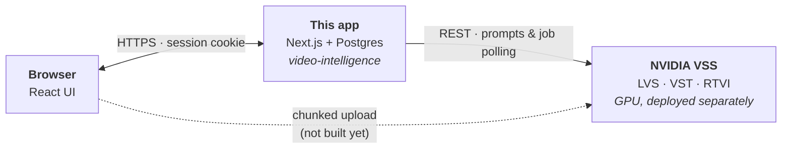
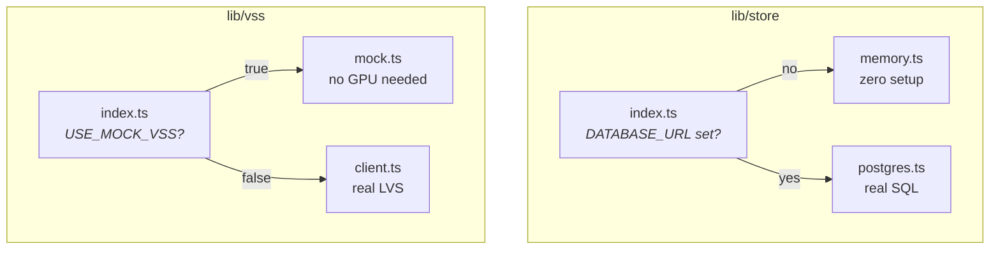
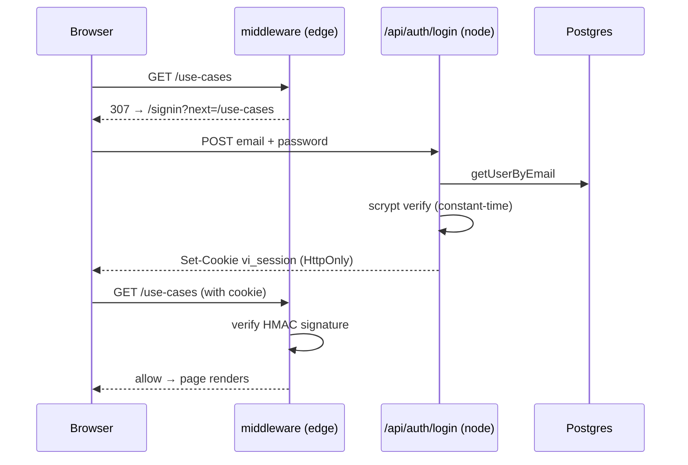
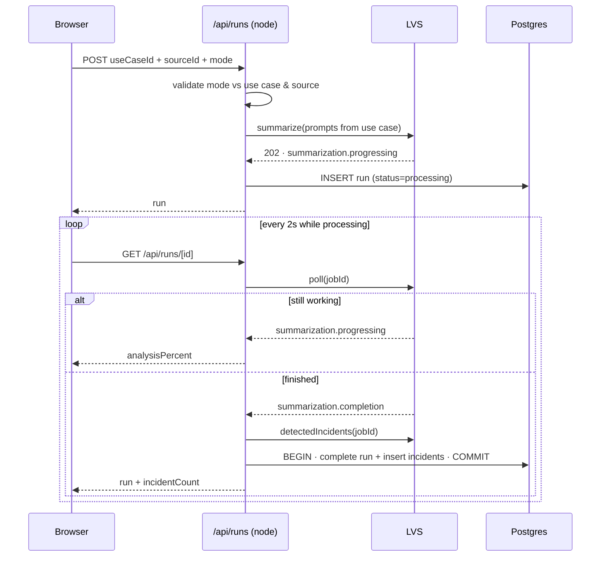
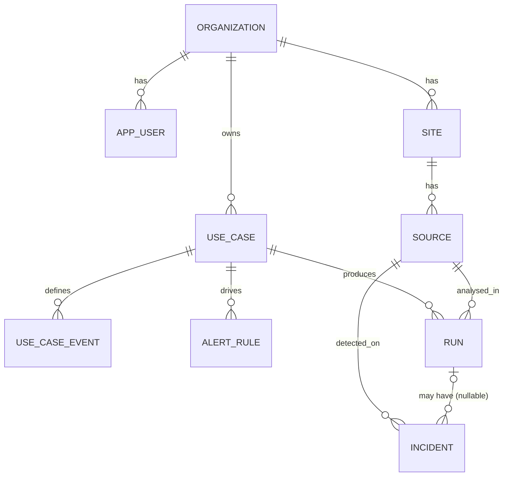

# Architecture

How this application is put together, and why the boundaries sit where they do.

**Companion document:** [`TECH-STACK.md`](./TECH-STACK.md) — what each technology is and why it was chosen.
**Product spec:** [`../VSS-Design-Document.md`](../VSS-Design-Document.md)

---

## 1. The big picture

Three separate systems. This repository is only the middle one.



**Why the app never proxies video:** a 2 GB file through a Next.js route handler
is slow, memory-hungry and hits body-size limits. NVIDIA's own UI uploads
browser → VST directly, so we follow that. The app only ever handles *metadata*.

**Consequence to plan for:** VST must be reachable from the user's browser, not
just from the server. If VSS sits behind a firewall, that is a networking task.

---

## 2. Where code runs

This is the distinction that matters most day to day. Getting it wrong is the
easiest way to leak a secret or crash the build.

| Layer | Runtime | Can it reach the DB? | Holds secrets? |
|---|---|---|---|
| Server components, route handlers | Node | ✅ yes | ✅ yes |
| `middleware.ts` | **Edge** | ❌ **no** | signing key only |
| `'use client'` components | Browser | ❌ no | ❌ **never** |

### Server (Node)

```
lib/store/postgres.ts     DB credentials
lib/vss/client.ts         NVIDIA_API_KEY
lib/auth/password.ts      node:crypto — would crash on edge
app/api/**/route.ts       every route handler
app/**/page.tsx           except app/runs/page.tsx
components/AppShell.tsx   async, calls currentUser()
```

### Edge

```
middleware.ts             signature check only, no DB
```

### Client (browser)

```
components/IncidentTimeline.tsx   useState
components/UseCaseForm.tsx
components/RunLauncher.tsx
components/SignInForm.tsx
components/SignOutButton.tsx
app/runs/page.tsx                 polling loop
```

> **The rule:** never import `lib/store`, `lib/vss/client` or
> `lib/auth/password` into a `'use client'` file. Server components fetch data
> and pass it **down as props** — that is how `IncidentTimeline` receives its
> incidents without ever touching the database.

---

## 3. The two swap points

Both follow the same shape: an interface, two implementations, one switch. This
is what let the entire app get built before any GPU existed.



Nothing else in the app knows which side is active. Flipping either is a
one-line `.env.local` change with **zero code edits**.

---

## 4. Request flows

### Signing in



The session cookie is `userId.expiresAt.signature`. **The expiry is inside the
signed payload**, so it cannot be extended client-side — verified by test.

Two layers, deliberately:

- **Middleware** rejects anyone without a valid signature. Cheap, runs on edge, cannot check the database.
- **`currentUser()`** re-reads on the Node side and confirms the user still exists and is `active`. A disabled user's cookie passes middleware but fails here.

> Middleware alone is **not** the authorisation boundary.

### Running an analysis



**Why completion is one transaction:** several tabs may poll simultaneously.
Split across two statements, a losing poll can read the run *after* status flips
but *before* incidents land, and briefly display "0 incidents found". Verified:
six concurrent polls previously returned `[0, 5]`; they now all return `5`.

**Severity is not taken from the model.** VSS reports *what* it saw; the use
case decides *how much it matters*. The route maps `eventCode → severity` from
the use case authored in C2. Unknown codes fall back to `medium` rather than
being dropped, so nothing detected goes silently missing.

---

## 5. Data model

The one rule worth protecting:



> **`incident.run_id` is nullable on purpose.** Incidents outlive the run that
> produced them and are queried by *source + time*, not by run. Search (D4),
> Map (D6) and the Incidents explorer (D7) all need this. Adding `NOT NULL`
> would block them, and the migration is painful once data exists.

**Severity lives on `use_case_event`, not on `alert_rule`.** That is what lets a
rule say "page for high only" without re-listing every event.

**Events diff by `code`, not array position.** Renaming an event's label keeps
its row id, so an `alert_rule` pointing at it survives the edit. Only genuinely
removed events cascade-delete their rules.

---

## 6. Directory map

```
app/
  api/              route handlers — server only
    auth/           login, logout
    runs/           POST starts a run · GET [id] polls
    use-cases/      CRUD
    sources/        list
    vss/health      is the backend mocked or live?
  use-cases/        C1 library · C2 new/edit · C3 run picker
  runs/             C4a progress list · C5 results
  signin/
components/         'use client' unless noted
lib/
  types.ts          domain types, mirror db/schema.sql
  store/            memory ⇄ postgres swap
  vss/              mock ⇄ real swap
  auth/             password (node only) · session (edge-safe)
  db.ts             pool + withTransaction
db/
  schema.sql        full schema
  seed.sql          dev fixtures
  migrations/       incremental changes
middleware.ts       edge gate
```

---

## 7. Known architectural gaps

Honest list. None of these are bugs — they are things not built yet.

| Gap | Consequence |
|---|---|
| **No background worker** | Runs only progress while a browser tab polls. Close it mid-run and it stays `processing` forever. |
| **No video upload** | `uploadPercent: 100` is a placeholder; nothing is actually uploaded. |
| **`detectedIncidents()` returns `[]` on the real client** | A real VSS run shows a summary with an empty timeline. Real detections must be parsed from captions or read from Elasticsearch. |
| **Live mode returns 501** | `/v1/stream_summarize`, RTVI and the C4b screen do not exist. |
| **No site scoping** | New use cases are created org-wide (`site_id` null). |
| **Single-tenant assumptions** | No org isolation in queries beyond `createUseCase`. |
| **No tests, no CI** | Every check so far has been run by hand. |
